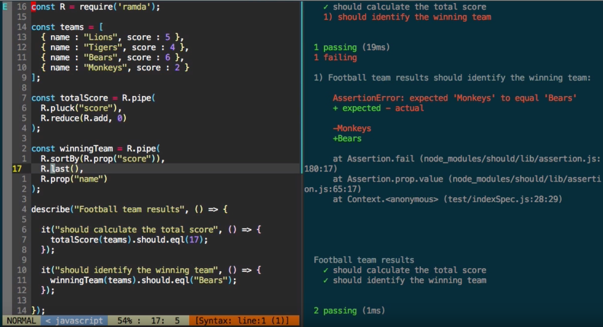

# Ramda Learning Template

A simple template to get myself set up for coding and testing with JavaScript and specifically [Ramda](http://ramdajs.com/). 
Based on a stripped down version of Bob Pace's [ramda-demo](https://github.com/bobpace/ramda-demo) repo, which
accompanies his great [Ramda Demo](https://www.youtube.com/watch?v=digajAH_5IU) video, which I recommend you
watch ... at least a couple of times, so it sinks in.

It incorporates the following elements for a smooth workflow:

- [Ramda](http://ramdajs.com/) itself
- [Babel](http://babeljs.io/) for the ES2015 syntax
- [Mocha](https://mochajs.org/) for the testing framework
- [should](https://www.npmjs.com/package/should) for the assertion library

The idea is that you set up the workflow within a dual-pane window in [tmux](https://tmux.github.io/), and run Mocha in "watch" mode
in one of the panes, modifying the code in the other. The tests will be rerun when the file is saved.

See this [short video](https://www.youtube.com/watch?v=FJkmPuQLLfw) for a demonstration:

It's not particularly specific to Ramda, it's more that it's a set of tools that work together well for me for learning more about Ramda.
